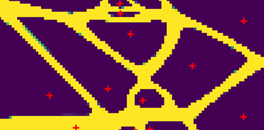
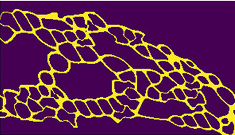
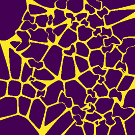
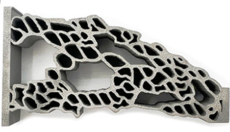
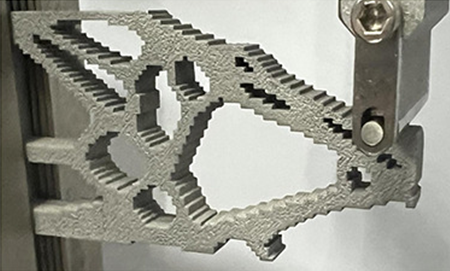
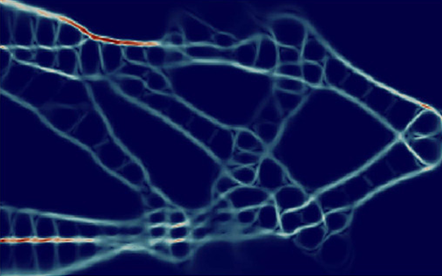

# Design optimization of graded cellular structures for additive manufacturing via differentiable Voronoi diagram
* DOI: https://doi.org/10.1016/j.cirp.2025.04.035

* topology optimization

* multiscale and pseudo sites

* pseudo sites for auxetics

* print result

* print result2

* von mises stress give out by JAX-FEM
# Here we supported 3 entrances of code:
* #### [manual.py](src/manual.py)
* #### [topo_mulitscale_principal.py](src/topo_mulitscale_principal.py)
* #### [topo_mutilscale.py](src/topo_mutilscale.py) (recommend)
######  (be careful with spelling mistakes)
#### [manual.py](src/manual.py) was used to generate samples for compression test.
#### The samples created by [topo_mulitscale_principal.py](src/topo_mulitscale_principal.py) are inserted with pseudo site points, along the first principal stress.
#### The [topo_mutilscale.py](src/topo_mutilscale.py) is deprecated, provides a very early version of the algorithm.

### THE [JAX-FEM](https://github.com/deepmodeling/jax-fem) was modified and employed for this project.
#### As the JAX-FEM is updating frequently, and some API are deprecated, so this project may not work at the lastest version of JAX-FEM.
#### The certain version of the JAX-FEM is contained in the [jax-fem-voronoi](...).
#### You can follow [README.md](..%2Fjax-fem-voronoi%2FREADME.md) in [jax-fem-voronoi](...) to install the requirements of JAX-FEM.
#### But you don't have to do the Option steps, as the modified jax-fem is already put at path [jax-fem-voronoi](..%2Fjax-fem-voronoi).
